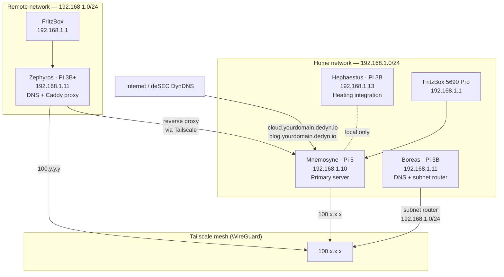

# Architecture & Design Decisions

This document explains the reasoning behind the key infrastructure choices in this homelab. Most decisions follow a consistent principle: **start lean, add complexity only when the need is proven.**

---

## Guiding Principles

- **Data sovereignty first.** No cloud dependency for anything that can reasonably run locally. Vaultwarden, Nextcloud, and Gitea exist specifically to replace cloud services with self-controlled alternatives.
- **Low maintenance overhead.** Auto-updates are disabled across the board. Updates happen deliberately, after a Diun notification, not silently in the background. A broken update at 2 AM is not acceptable.
- **No single points of failure in tooling.** Tools are chosen for longevity and simplicity. If a tool disappears tomorrow, the underlying data (files, SQLite DBs, plain configs) remains accessible.
- **arm64 compatibility is a hard constraint.** Every image, every dependency, must run on Raspberry Pi hardware. This eliminates a significant number of otherwise attractive options.

---

## Host Split: Mnemosyne + Boreas + Zephyros

Network services (DNS, DHCP) run on dedicated hosts separate from application services on Mnemosyne (Pi 5). Boreas (Pi 3B) serves the home network; Zephyros (Pi 3B+) serves the remote network.

If Mnemosyne goes down for maintenance or a failed update, DNS continues working on both networks. The reverse is also true: rebooting Boreas or Zephyros for a Pi-hole update does not affect any running applications.

Both networks use the `192.168.1.0/24` address range — a deliberate non-issue. Zephyros does not advertise a subnet route via Tailscale, so there is no routing conflict. Tailscale addresses it exclusively by its `100.x.x.x` IP from remote its local network.

---

## Reverse Proxy: Caddy

**Why not nginx or Traefik?**

Nginx requires manual TLS certificate management or a separate Certbot integration. Traefik's dynamic configuration via Docker labels is powerful but adds cognitive overhead and makes configs harder to read at a glance.

Caddy handles TLS automatically — both Let's Encrypt for public domains (`cloud.yourdomain.dedyn.io`, `blog.yourdomain.dedyn.io`) and an internal CA for `.home` domains. The Caddyfile syntax is minimal and readable. Adding a new service is a three-line block. Reloading config requires no container restart.

The internal CA means all local services run on HTTPS without self-signed certificate warnings, after a one-time import of the Caddy root certificate on each client.

**Caddy on Zephyros**

A second Caddy instance runs on Zephyros as a lightweight reverse proxy. It forwards `.home` requests from the remote network to Mnemosyne via Tailscale. This allows access to Ghostwrite and GhostProxy from an iPhone without Tailscale installed — only the Zephyros CA certificate needs to be imported once. The same pattern is the proof of concept for a planned Boreas Caddy stack that will serve the parents' network after a future move.

---

## DNS: Pi-hole + Unbound

**Why not Pi-hole alone?**

Pi-hole alone forwards DNS queries to an upstream resolver (Cloudflare, Google, etc.). That upstream provider sees every query from the network. Unbound eliminates this by resolving DNS recursively — it queries the authoritative nameservers directly, without a third-party intermediary.

The combination gives both ad-blocking (Pi-hole) and full DNS privacy (Unbound). The performance overhead of recursive resolution is negligible on a local network.

**Why not a single combined tool?**

Pi-hole and Unbound are purpose-fit and well-maintained independently. Combining them into a single container would mean taking on someone else's integration layer. The two-service setup is more transparent and easier to debug.

---

## Stack Layout: One Directory Per Service

All services live under `~/stacks/<service>/` with their own `docker-compose.yml`. There is no single monolithic Compose file.

This means each service can be started, stopped, updated, and debugged independently. `docker compose down` in `~/stacks/nextcloud/` does not affect Vaultwarden. This also maps cleanly to how teams manage services in production — isolated, with clear ownership boundaries.

The tradeoff is slightly more directory navigation. It is worth it.

---

## Docker and containerd Storage on SSD

By default, Docker writes image layers, volumes, and container state to `/var/lib/docker` on the boot device (SD card). containerd independently writes its content store to `/var/lib/containerd`. On a Raspberry Pi with a large stack, both directories grow to 15–20 GB and will eventually exhaust SD card space.

Both roots are redirected to the SSD:

- Docker: `/etc/docker/daemon.json` → `"data-root": "/mnt/codex/docker"`
- containerd: `/etc/containerd/config.toml` → `root = "/mnt/codex/containerd"`

**Critical:** Docker's `data-root` setting does not affect containerd. If only the Docker data root is moved, containerd continues writing to the SD card and will rebuild its cache there after every restart. Both must be configured explicitly.

---

## Gitea Over GitHub/GitLab

Infrastructure configs contain internal IP addresses, domain names, and stack layouts that reveal the network topology. Storing these in a public or third-party-hosted repository creates unnecessary exposure, even without credentials.

Gitea runs on Mnemosyne. It is not port-forwarded. It is not reachable from the internet. Remote access, when needed, goes through Tailscale. GitLab would provide more features but requires significantly more RAM and maintenance. For a solo operator, Gitea with SQLite is the right tool.

**Why SQLite for Gitea?**

A separate MariaDB or PostgreSQL instance for Gitea adds another service to maintain, another backup target, and another failure point. SQLite is sufficient for a single-user instance and is backed up with a single `tar` command alongside the repository data.

**CI/CD: Gitea Actions**

A Gitea Act Runner handles validation on every push. The runner runs on Mnemosyne in a Docker container with the Caddy root CA mounted so it can clone from `git.home`. Gitea Free does not support repository secrets — the clone token is passed via the runner's `.env` file. The existing webhook handler remains in charge of deployments; Actions is used exclusively for validation (YAML lint, Prometheus rule checks, Grafana JSON, shellcheck, `.env.example` completeness).

---

## Secrets Management

Credentials are stored in `.env` files, one per stack. These files are listed in `.gitignore` and are never committed. Each stack ships with a `.env.example` containing variable names and placeholder values.

For systemd services (Pi-hole exporter on Boreas and Zephyros), the equivalent is an `EnvironmentFile` with `chmod 600`. The service unit itself — which is committed — contains no credentials.

This pattern mirrors the approach used in professional environments: committed code describes structure, runtime secrets are injected from remote version control.

---

## Monitoring: Prometheus + Grafana Over Netdata

Netdata was the initial monitoring solution. It was replaced for two reasons.

First, Prometheus + Grafana is the industry standard stack for infrastructure monitoring. Familiarity with it has direct professional value in a way that Netdata does not.

Second, the pull-based model of Prometheus scales naturally. Adding a new scrape target (a new host, a custom exporter) requires one config block in `prometheus.yml`. The custom exporters in this setup — for Philips Hue, for Pi-hole v6, for Netatmo weather, for Shelly smart plugs — were built specifically because the pull model makes it straightforward to expose any metric from any source.

**Textfile collector pattern**

For metrics that cannot be scraped live (Pi 5 fan level, Tailscale status, backup results, Viessmann heating data), Node Exporter's textfile collector is used. A shell script or cron job writes a `.prom` file to `/var/lib/node_exporter/textfile_collector/`, and Node Exporter picks it up on the next scrape. This avoids running an additional long-lived process for each metric source.

**Shelly Exporter**

A custom Python exporter (`shelly-exporter`) polls Shelly smart plugs via their local REST API — Gen1 devices via `/status`, Gen2/3 via `/rpc/Switch.GetStatus`. No cloud, no MQTT. Devices are configured via the `SHELLY_DEVICES` environment variable in the format `name:host:gen`. The exporter runs on Mnemosyne on port `9117`.

**Scrape topology**

```mermaid
graph TD
    Prometheus["Prometheus
Mnemosyne :9090"]

    subgraph mnemosyne["Mnemosyne"]
        NE_M["Node Exporter :9100
+ textfile collector
(fan, tailscale, backup)"]
        Blackbox["Blackbox Exporter :9115"]
        Netatmo["Netatmo Exporter :9210"]
        Fritz_H["Fritz Exporter :9787
home FritzBox"]
        Tado["Tado Exporter"]
        NC_Exp["Nextcloud Exporter :9205"]
        cAdvisor["cAdvisor :8080"]
        Hue["Hue Exporter :9366"]
        Shelly["Shelly Exporter :9117"]
        Gitea_Exp["Gitea Exporter"]
    end

    subgraph boreas["Boreas (via LAN)"]
        NE_B["Node Exporter :9100"]
        PH_B["pihole6-exporter :9666"]
    end

    subgraph zephyros["Zephyros (via Tailscale)"]
        NE_Z["Node Exporter :9100"]
        PH_Z["pihole6-exporter :9666"]
        Fritz_P["Fritz Exporter :9787
remote FritzBox"]
    end

    subgraph hephaestus["Hephaestus (via LAN)"]
        NE_H["Node Exporter :9100
+ textfile collector
(viessmann)"]
    end

    Prometheus --> NE_M & Blackbox & Netatmo & Fritz_H & Tado & NC_Exp & cAdvisor & Hue & Shelly & Gitea_Exp
    Prometheus --> NE_B & PH_B
    Prometheus --> NE_Z & PH_Z & Fritz_P
    Prometheus --> NE_H

    Grafana["Grafana
Mnemosyne :3001"] --> Prometheus
```

---

## Backup Philosophy

The backup strategy follows the 3-2-1 rule: three copies, two media types, one offsite. The implementation is a shell script (`backup-services.sh`) with explicit steps, colored output, and a step counter — not a black box.

Named Docker volumes require an Alpine container workaround to archive without stopping the service. This is documented and handled in the script rather than avoided by switching to host mounts everywhere. Understanding why it is necessary is more useful than pretending the problem does not exist.

The backup SSD is formatted as exFAT, which does not support hardlinks or symlinks. The `has_changed()` helper function and `.SKIPPED` marker files are used to skip unchanged archives and avoid re-copying data unnecessarily.

Restore procedures are documented and tested. A backup that has never been restored is not a backup.

---

## Viessmann Heating Integration: Optolink over Vitoconnect

The VITOLA 200 oil boiler (2003, Vitotronic 200 KW2) is integrated via a USB Optolink adapter on a dedicated third Pi — Hephaestus (Pi 3B).

**Why not Vitoconnect OPTO2?**

Vitoconnect is Viessmann's official cloud gateway. It was rejected on three grounds: it requires a mandatory cloud dependency (all data routes through Viessmann servers), it costs ~200 € for hardware that is older than this boiler, and it is not guaranteed to support the KW2 protocol at all.

The Optolink approach is fully local. No cloud, no subscription, no external dependency. All data stays on the local network.

**Why a dedicated host?**

The USB Optolink adapter must be physically plugged into the boiler's infrared port in the basement. Running a cable to Mnemosyne upstairs was not feasible. A Pi 3B is sufficient for the workload: vcontrold daemon, a Prometheus textfile exporter cron job, and a Flask control API. Hephaestus is deliberately minimal — no Docker stack complexity beyond Node Exporter.

**Read-only by default**

The control API (`viessmann-api.service`) is designed to be disabled when not actively needed. Monitoring via the Prometheus textfile collector runs independently of the API and is always active. The separation is intentional: observability should never depend on write-access infrastructure.

**KW protocol constraints**

The Vitotronic 200 KW2 uses the older KW serial protocol — not the bidirectional P protocol of newer Viessmann controllers. Each data point is queried sequentially. A full exporter run takes ~30 seconds. The scrape interval in Prometheus is set to 60s accordingly. Write commands use a threading lock and retry logic to prevent conflicts with the exporter cron.

**Heating curve adjustment over direct control**

The integration deliberately avoids direct mode switching (Betriebsart) in normal operation. The KW2 state machine does not always respond predictably to remote mode changes — the heating circuit pump may not start without a reset cycle. Neigung and Niveau adjustments are safe to make remotely because they are passive register values that the KW2 reads on its next cycle, with no state transition required.
