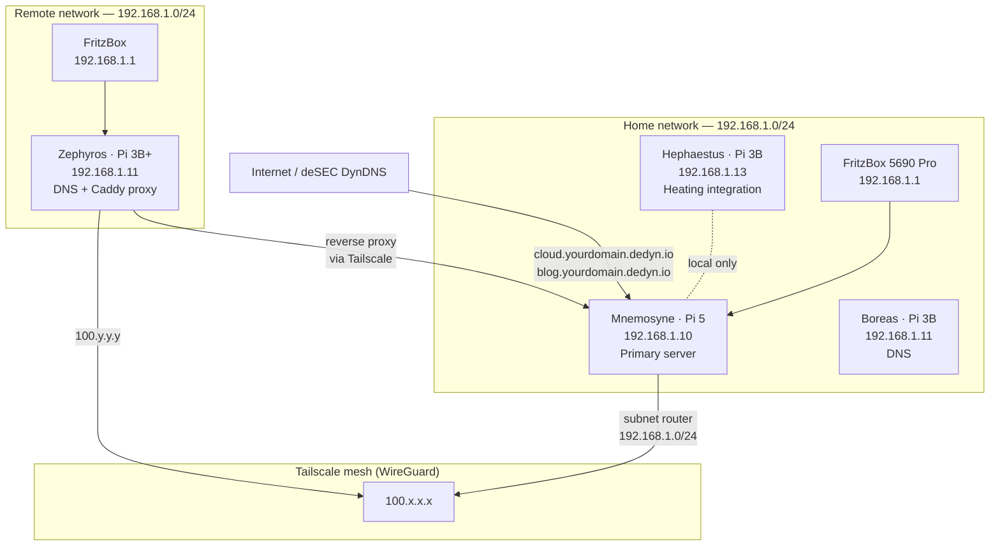

# Architecture & Design Decisions

This document explains the reasoning behind the key infrastructure choices in this homelab. Most decisions follow a consistent principle: **start lean, add complexity only when the need is proven.**

---

## Guiding Principles

- **Data sovereignty first.** No cloud dependency for anything that can reasonably run locally. Vaultwarden, Nextcloud, and Gitea exist specifically to replace cloud services with self-controlled alternatives.
- **Low maintenance overhead.** Auto-updates are disabled across the board. Updates happen deliberately, after a Diun notification, not silently in the background. A broken update at 2 AM is not acceptable.
- **No single points of failure in tooling.** Tools are chosen for longevity and simplicity. If a tool disappears tomorrow, the underlying data (files, SQLite DBs, plain configs) remains accessible.
- **arm64 compatibility is a hard constraint.** Every image, every dependency, must run on Raspberry Pi hardware. This eliminates a significant number of otherwise attractive options.

---

## Host Split: Mnemosyne + Boreas + Zephyros

Network services (DNS, DHCP) run on dedicated hosts separate from application services on Mnemosyne (Pi 5). Boreas (Pi 3B) serves the home network; Zephyros (Pi 3B+) serves the remote network.

If Mnemosyne goes down for maintenance or a failed update, DNS continues working on both networks. The reverse is also true: rebooting Boreas or Zephyros for a Pi-hole update does not affect any running applications.

Both networks use the `192.168.1.0/24` address range — a deliberate non-issue. Zephyros does not advertise a subnet route via Tailscale, so there is no routing conflict. Tailscale addresses it exclusively by its `100.x.x.x` IP from remote its local network.

```mermaid
graph TD
    subgraph home["Home network — 192.168.1.0/24"]
        Mnemosyne["Mnemosyne · Pi 5<br/>192.168.1.10<br/>Primary server"]
        Boreas["Boreas · Pi 3B<br/>192.168.1.11<br/>DNS"]
        Hephaestus["Hephaestus · Pi 3B<br/>192.168.1.13<br/>Heating integration"]
        FritzHome["FritzBox 5690 Pro<br/>192.168.1.1"]
    end

    subgraph remote["Remote network — 192.168.1.0/24"]
        Zephyros["Zephyros · Pi 3B+<br/>192.168.1.11<br/>DNS + Caddy proxy"]
        FritzRemote["FritzBox<br/>192.168.1.1"]
    end

    subgraph tailscale["Tailscale mesh (WireGuard)"]
        TS["100.x.x.x"]
    end

    Internet["Internet / deSEC DynDNS"]

    Mnemosyne -- "subnet router\n192.168.1.0/24" --> TS
    Zephyros -- "100.y.y.y" --> TS
    Hephaestus -. "local only" .- Mnemosyne
    FritzHome --> Mnemosyne
    FritzRemote --> Zephyros
    Zephyros -- "reverse proxy\nvia Tailscale" --> Mnemosyne
    Internet -- "cloud.yourdomain.dedyn.io\nblog.yourdomain.dedyn.io" --> Mnemosyne
```

---

## Reverse Proxy: Caddy

**Why not nginx or Traefik?**

Nginx requires manual TLS certificate management or a separate Certbot integration. Traefik's dynamic configuration via Docker labels is powerful but adds cognitive overhead and makes configs harder to read at a glance.

Caddy handles TLS automatically — both Let's Encrypt for public domains (`cloud.yourdomain.dedyn.io`, `blog.yourdomain.dedyn.io`) and an internal CA for `.home` domains. The Caddyfile syntax is minimal and readable. Adding a new service is a three-line block. Reloading config requires no container restart.

The internal CA means all local services run on HTTPS without self-signed certificate warnings, after a one-time import of the Caddy root certificate on each client.

**Caddy on Zephyros**

A second Caddy instance runs on Zephyros as a lightweight reverse proxy. It forwards `.home` requests from the remote network to Mnemosyne via Tailscale. This allows access to Ghostwrite and GhostProxy from an iPhone without Tailscale installed — only the Zephyros CA certificate needs to be imported once. The same pattern is the proof of concept for a planned Boreas Caddy stack that will serve the parents' network after a future move.

---

## DNS: Pi-hole + Unbound

**Why not Pi-hole alone?**

Pi-hole alone forwards DNS queries to an upstream resolver (Cloudflare, Google, etc.). That upstream provider sees every query from the network. Unbound eliminates this by resolving DNS recursively — it queries the authoritative nameservers directly, without a third-party intermediary.

The combination gives both ad-blocking (Pi-hole) and full DNS privacy (Unbound). The performance overhead of recursive resolution is negligible on a local network.

**Why not a single combined tool?**

Pi-hole and Unbound are purpose-fit and well-maintained independently. Combining them into a single container would mean taking on someone else's integration layer. The two-service setup is more transparent and easier to debug.

---

## Stack Layout: One Directory Per Service

All services live under `~/stacks/<service>/` with their own `docker-compose.yml`. There is no single monolithic Compose file.

This means each service can be started, stopped, updated, and debugged independently. `docker compose down` in `~/stacks/nextcloud/` does not affect Vaultwarden. This also maps cleanly to how teams manage services in production — isolated, with clear ownership boundaries.

The tradeoff is slightly more directory navigation. It is worth it.

---

## Docker and containerd Storage on SSD

By default, Docker writes image layers, volumes, and container state to `/var/lib/docker` on the boot device (SD card). containerd independently writes its content store to `/var/lib/containerd`. On a Raspberry Pi with a large stack, both directories grow to 15–20 GB and will eventually exhaust SD card space.

Both roots are redirected to the SSD:

- Docker: `/etc/docker/daemon.json` → `"data-root": "/mnt/codex/docker"`
- containerd: `/etc/containerd/config.toml` → `root = "/mnt/codex/containerd"`

**Critical:** Docker's `data-root` setting does not affect containerd. If only the Docker data root is moved, containerd continues writing to the SD card and will rebuild its cache there after every restart. Both must be configured explicitly.

---

## Gitea Over GitHub/GitLab

Infrastructure configs contain internal IP addresses, domain names, and stack layouts that reveal the network topology. Storing these in a public or third-party-hosted repository creates unnecessary exposure, even without credentials.

Gitea runs on Mnemosyne. It is not port-forwarded. It is not reachable from the internet. Remote access, when needed, goes through Tailscale. GitLab would provide more features but requires significantly more RAM and maintenance. For a solo operator, Gitea with SQLite is the right tool.

**Why SQLite for Gitea?**

A separate MariaDB or PostgreSQL instance for Gitea adds another service to maintain, another backup target, and another failure point. SQLite is sufficient for a single-user instance and is backed up with a single `tar` command alongside the repository data.

**CI/CD: Gitea Actions**

A Gitea Act Runner handles validation on every push. The runner runs on Mnemosyne in a Docker container with the Caddy root CA mounted so it can clone from `git.home`. Gitea Free does not support repository secrets — the clone token is passed via the runner's `.env` file. The existing webhook handler remains in charge of deployments; Actions is used exclusively for validation (YAML lint, Prometheus rule checks, Grafana JSON, shellcheck, `.env.example` completeness).

---

## Secrets Management

Credentials are stored in `.env` files, one per stack. These files are listed in `.gitignore` and are never committed. Each stack ships with a `.env.example` containing variable names and placeholder values.

For systemd services (Pi-hole exporter on Boreas and Zephyros), the equivalent is an `EnvironmentFile` with `chmod 600`. The service unit itself — which is committed — contains no credentials.

This pattern mirrors the approach used in professional environments: committed code describes structure, runtime secrets are injected from remote version control.

---

## Monitoring: Prometheus + Grafana Over Netdata

Netdata was the initial monitoring solution. It was replaced for two reasons.

First, Prometheus + Grafana is the industry standard stack for infrastructure monitoring. Familiarity with it has direct professional value in a way that Netdata does not.

Second, the pull-based model of Prometheus scales naturally. Adding a new scrape target (a new host, a custom exporter) requires one config block in `prometheus.yml`. The custom exporters in this setup — for Pi-hole v6, for Netatmo weather, for Shelly smart plugs — were built specifically because the pull model makes it straightforward to expose any metric from any source.

**Textfile collector pattern**

For metrics that cannot be scraped live (Pi 5 fan level, Tailscale status, backup results, Viessmann heating data), Node Exporter's textfile collector is used. A shell script or cron job writes a `.prom` file to `/var/lib/node_exporter/textfile_collector/`, and Node Exporter picks it up on the next scrape. This avoids running an additional long-lived process for each metric source.

**Shelly Exporter**

A custom Python exporter (`shelly-exporter`) polls Shelly smart plugs via their local REST API — Gen1 devices via `/status`, Gen2/3 via `/rpc/Switch.GetStatus`. No cloud, no MQTT. Devices are configured via the `SHELLY_DEVICES` environment variable in the format `name:host:gen`. The exporter runs on Mnemosyne on port `9117`.

**Midea Exporter**

A custom Python exporter (`midea-exporter`) polls a Midea WiFi air conditioner
over the local LAN protocol via `msmart-ng`. Midea's local protocol needs a
`token`/`key` pair that only the cloud API hands out, which would normally
mean a permanent cloud dependency for a device on the local network. The
exporter instead runs cloud discovery exactly once, caches the resulting
credentials to disk, and authenticates locally on every run after — the
device can be firewalled off the internet once the cache exists. The exporter
runs on Mnemosyne on port `9116`. See
`mnemosyne/stacks/monitoring/midea_exporter/README.md` for the credential
quirks that make this necessary.

**Prusa Exporter**

A custom Python exporter (`prusa-exporter`) polls the Prusa MK4S (Pygmalion) via PrusaLink's local `/api/v1/status` endpoint — no Prusa Connect, no cloud. The firmware only accepts HTTP Digest auth (`maker` + password) on this endpoint; the API-key header returns 401, verified empirically, so the exporter is configured with `PRUSA_PASSWORD` rather than `PRUSA_API_KEY`. On an unreachable printer it emits only `prusa_up 0` and nothing else, so a dead scrape shows as a gap in Grafana rather than stale-but-green data. Print done/fail notifications are deliberately left to the Prusa mobile app rather than routed through Alertmanager/ntfy — that would just be a duplicate notification for the same event. The exporter runs on Mnemosyne on port `9118`.

**Alertmanager**

Prometheus routes firing alerts to Alertmanager (`alertmanager.home`, port `9093`), which forwards them to ntfy topics. Separate topics are configured per severity (critical / warning) and per alert group (Mnemosyne infrastructure, Viessmann heating pump). Alertmanager runs in the same `monitoring` stack as Prometheus; its configuration is templated at startup so ntfy topic names stay out of the committed file.

**Scrape topology**

```mermaid
graph TD
    Prometheus["Prometheus
Mnemosyne :9090"]
    Alertmanager["Alertmanager
Mnemosyne :9093"]

    subgraph mnemosyne["Mnemosyne"]
        NE_M["Node Exporter :9100
+ textfile collector
(fan, tailscale, backup)"]
        Blackbox["Blackbox Exporter :9115"]
        Netatmo["Netatmo Exporter :9210"]
        Fritz_H["Fritz Exporter :9787
home FritzBox"]
        Tado["Tado Exporter"]
        NC_Exp["Nextcloud Exporter :9205"]
        cAdvisor["cAdvisor :8080"]
        Shelly["Shelly Exporter :9117"]
        Meross["Meross Exporter :9114"]
        Midea["Midea Exporter :9116"]
        Prusa["Prusa Exporter :9118"]
        Wakapi["Wakapi :3000
/api/metrics"]
        Gitea_Exp["Gitea Exporter"]
    end

    subgraph boreas["Boreas (via LAN)"]
        NE_B["Node Exporter :9100"]
        PH_B["pihole6-exporter :9666"]
    end

    subgraph zephyros["Zephyros (via Tailscale)"]
        NE_Z["Node Exporter :9100"]
        PH_Z["pihole6-exporter :9666"]
        Fritz_P["Fritz Exporter :9787
remote FritzBox"]
        Fritz_Lua["Fritz Exporter Lua :9042
DECT + system metrics"]
    end

    subgraph hephaestus["Hephaestus (via LAN)"]
        NE_H["Node Exporter :9100
+ textfile collector
(viessmann)"]
    end

    subgraph astraeus["Astraeus + desktop (via LAN)"]
        Windows_E["windows_exporter :9182"]
    end

    Prometheus --> NE_M & Blackbox & Netatmo & Fritz_H & Tado & NC_Exp & cAdvisor & Shelly & Meross & Midea & Prusa & Wakapi & Gitea_Exp
    Prometheus --> NE_B & PH_B
    Prometheus --> NE_Z & PH_Z & Fritz_P & Fritz_Lua
    Prometheus --> NE_H
    Prometheus --> Windows_E
    Prometheus -. "alerts" .-> Alertmanager

    Grafana["Grafana
Mnemosyne :3000"] --> Prometheus
```

---

## Aether: A Weather Frontend, Not a New Integration

Aether (`weather.home`) is a Flask console showing Netatmo, Tado, and Shelly
readings plus an Open-Meteo forecast — a calmer, glanceable alternative to a
Grafana dashboard for a specific everyday question ("do I need a jacket").

**Why not Home Assistant?**

The obvious way to get a nice weather UI is Home Assistant. It was rejected
because Netatmo, Tado, and Shelly are already integrated once each, via their
Prometheus exporters. Adding Home Assistant would mean re-integrating all three
devices a second time — a second OAuth flow, a second polling schedule, a
second place credentials can go stale. That is integration work with no new
capability behind it. Aether queries the Prometheus HTTP API directly and
stores nothing itself; it is a display, not a second source of truth.

**Sensors are config, not code**

Every tile in `sensors.yaml` is a PromQL expression plus a label. Adding a
sensor or a room is a YAML block, not a Python change or a rebuild — the same
"boring, auditable" bias as everywhere else in this repo. See
`mnemosyne/stacks/aether/README.md` for the full catalog format.

**Scope: Home only.** Fuchsbau sensors are deliberately excluded from
`sensors.yaml` — Aether may be shared or shown to others, and that data stays
private.

**Local-first, with one deliberate exception**

The Netatmo/Tado tiles depend on those vendors' cloud APIs (via their existing
exporters) — an existing tether, not a new one. The optional radar map is the
only genuinely new external dependency: it is lazy-loaded (nothing fetched
until a user clicks "Show radar"), but while open it streams tiles from
OpenStreetMap and either DWD or RainViewer, which — like any web map — can leak
the client's IP. This is accepted as a scoped, opt-in tradeoff rather than
built as a blocking requirement; a fully local path (self-hosted map tiles +
local RADOLAN processing) remains possible later if the tradeoff stops being
acceptable.

**Forecast coordinates are a privacy boundary, not a config detail**

The Open-Meteo forecast needs a latitude/longitude, set in `sensors.yaml` under
`settings.location`. Town-centre coordinates are used deliberately, not the
exact address, since a forecast is identical across a town. `sensors.yaml`
should be treated as sensitive by `export_public.py` for this reason — as of
this writing the export script's replacement rules do not account for it, so
the real coordinates would currently pass through into the public mirror
unredacted. This needs a fix in `export_public.py` before the file is safe to
publish; flagged rather than changed here per this repo's rule that the
public-mirror tooling is not touched without a heads-up.

---

## Carousel: A Deterministic PDF Pipeline, Not a Browser Renderer

Carousel (`carousel.home`) turns a Markdown post into ready-to-upload Instagram
carousel slides (1080x1440 PNGs) plus matching alt text. It was built for
independent use by a blind author with VoiceOver on iOS.

**Why WeasyPrint instead of a headless browser?**

The obvious way to turn styled text into an image is a browser engine —
Playwright or Puppeteer rendering HTML to a screenshot. That was rejected for
two reasons. First, text overflow: a browser viewport has to be measured and
iterated against to guarantee text fits a fixed-size frame, which is exactly
the kind of fragile, stateful process this repo's guiding principle warns
against. WeasyPrint instead paginates Markdown-derived HTML/CSS into a PDF
against a fixed page size — text overflow is impossible by construction, not
guarded against. Second, weight: a headless browser is a heavy dependency to
run on a Raspberry Pi for a single-user tool; WeasyPrint plus `pdftoppm` is not.

**Accessibility as a design constraint, not an add-on**

The frontend is semantic HTML with native form elements and no JavaScript, so
VoiceOver can drive the whole workflow without workarounds. This ruled out any
approach that would have depended on canvas/JS rendering (client-side preview,
drag-and-drop template editing) for the main tool — the offline
`tools/template-editor.html` design tool is deliberately kept separate from the
authoring flow for this reason.

**Templates are config, not code**

Each visual design lives in `templates_ig/<id>/` as a `template.json` plus
source artwork — the same "config, not code" pattern used for Aether's
`sensors.yaml`. Adding a template is dropping in a folder, not touching
`app/renderer.py`.

---

## Backup Philosophy

The backup strategy follows the 3-2-1 rule: three copies, two media types, one offsite. The implementation is a shell script (`backup-services.sh`) with explicit steps, colored output, and a step counter — not a black box.

Every source is declared in one `SOURCE_PATHS` map, and a drift check compares that map against the bind mounts of all running containers. A mount that is neither backed up nor explicitly excluded raises an alert. Exclusions are written down with a reason next to them — including one accepted loss (Wakapi) — so "not backed up" is always a decision, never an oversight.

The backup SSD is formatted as exFAT, which does not support hardlinks or symlinks. The `has_changed()` helper function and `.SKIPPED` marker files are used to skip unchanged archives and avoid re-copying data unnecessarily.

Restore procedures are documented and tested. A backup that has never been restored is not a backup.

**A backup that did not happen must not look like one that did**

Most of the backup work in summer 2026 was not about producing archives but about making failures visible. Three incidents shaped it: a stale restic lock that blocked retention for six weeks while its error went to `/dev/null`, three `203/EXEC` failures where the script could not start and therefore could not report that it had not started, and a named-volume backup that "succeeded" every night with an 85-byte archive. The answers are structural rather than more careful scripting: every stage writes Prometheus metrics, every systemd unit additionally records its own outcome via `ExecStopPost=` (a second, independent writer that sees failures the script cannot), an archive with fewer entries than expected fails the run (and any archive under 1 KiB raises a separate alert), and the nightly backup moved from cron to a systemd timer so its output reaches the journal and Loki.

**Offsite: Hetzner Storage Box, not a general-purpose cloud**

The offsite copy exists to survive a scenario the local backup disk cannot: theft, fire, or any event that takes Mnemosyne and the WD My Passport out simultaneously, since both live in the same room. A Storage Box was chosen over Backblaze B2 or a consumer cloud drive for three reasons: it is billed flat per TB rather than per API call or egress, which matters for a backup that runs every night; it speaks plain SFTP, so the backup tool needs no vendor SDK or OAuth flow, only an SSH key; and it is hosted in Germany/Finland, which matters for the same data-sovereignty reasoning that rules out cloud dependency elsewhere in this document.

**Why restic, not `rclone crypt`** *(supersedes the original rclone design)*

The first offsite implementation synced `/mnt/backup` through an `rclone crypt` remote. Encryption was never the problem — client-side encryption with the provider seeing only ciphertext was the right requirement, and restic keeps it. Bandwidth was: `rclone sync` has no deduplication, so the ~73 GB Nextcloud tarball, which barely changes from night to night, was re-uploaded in full every time it was rewritten. A home uplink cannot sustain that, and a 524 GB backlog built up.

restic chunks and deduplicates, so a near-identical tarball costs near-zero upload — provided the tarball itself is deterministic, which is why the large archives are now written with `tar --sort=name`. It also keeps versioned snapshots (7 daily, 4 weekly, 6 monthly) instead of a single mirror, so a corrupted local backup can no longer overwrite the only offsite copy, and it can verify the remote data itself: the weekly `restic check --read-data-subset=2%` re-reads a rotating slice of the repository from Hetzner. The tradeoff is unchanged from rclone: the repository password is a single point of failure. It is stored in Vaultwarden and in one offline copy, and nowhere else.

**Why offsite is a separate service, not a step inside `backup-services.sh`** *(supersedes the integrated-step design)*

The rclone design deliberately made offsite one more step inside the existing script, to avoid duplicating retention, logging and metrics scaffolding for a second script. That reasoning held for complexity, but failed in operation: the offsite step's failures were buried in the local backup's log and exit code, and an offsite stall went unnoticed for three nights.

Offsite now runs as its own oneshot unit, `restic-offsite.service`. `backup-services.sh` starts it with `systemctl start --no-block` only after a run with zero errors — a broken local backup is never shipped offsite — and `restic-offsite.timer` fires at 06:00 as a fallback for nights where the trigger was missed. The service has its own exit codes (backup failed vs. retention failed are different problems with different urgency), its own metrics and alerts, and systemd hardening the local backup cannot have. Heavy work (`prune`, `check`) runs weekly in `restic-maintenance.service`. Both restic units share one `flock` on the repository, so an overlap makes the second process exit instead of being killed mid-transfer by a `Conflicts=` directive, which is how the first version handled it.

The extra scaffolding the original design wanted to avoid turned out to be the point: an offsite copy that fails silently is worse than no offsite copy, because it is trusted.

---

## Viessmann Heating Integration: Optolink over Vitoconnect

The VITOLA 200 oil boiler (2003, Vitotronic 200 KW2) is integrated via a USB Optolink adapter on a dedicated third Pi — Hephaestus (Pi 3B).

**Why not Vitoconnect OPTO2?**

Vitoconnect is Viessmann's official cloud gateway. It was rejected on three grounds: it requires a mandatory cloud dependency (all data routes through Viessmann servers), it costs ~200 € for hardware that is older than this boiler, and it is not guaranteed to support the KW2 protocol at all.

The Optolink approach is fully local. No cloud, no subscription, no external dependency. All data stays on the local network.

**Why a dedicated host?**

The USB Optolink adapter must be physically plugged into the boiler's infrared port in the basement. Running a cable to Mnemosyne upstairs was not feasible. A Pi 3B is sufficient for the workload: vcontrold daemon, a Prometheus textfile exporter cron job, and a Flask control API. Hephaestus is deliberately minimal — no Docker stack complexity beyond Node Exporter.

**Read-only by default**

The control API (`viessmann-api.service`) is designed to be disabled when not actively needed. Monitoring via the Prometheus textfile collector runs independently of the API and is always active. The separation is intentional: observability should never depend on write-access infrastructure.

**KW protocol constraints**

The Vitotronic 200 KW2 uses the older KW serial protocol — not the bidirectional P protocol of newer Viessmann controllers. Each data point is queried sequentially. A full exporter run takes ~30 seconds. The scrape interval in Prometheus is set to 60s accordingly. Write commands use a threading lock and retry logic to prevent conflicts with the exporter cron.

**Heating curve adjustment over direct control**

The integration deliberately avoids direct mode switching (Betriebsart) in normal operation. The KW2 state machine does not always respond predictably to remote mode changes — the heating circuit pump may not start without a reset cycle. Neigung and Niveau adjustments are safe to make remotely because they are passive register values that the KW2 reads on its next cycle, with no state transition required.
