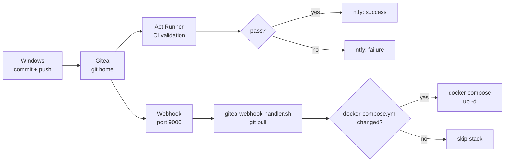

# homelab-infra

[](https://github.com/Andre-A-Dev/homelab-infra/actions/workflows/validate.yml)

Infrastructure-as-code for a privacy-first Raspberry Pi homelab. Covers Docker Compose stacks, reverse proxy, DNS, monitoring configs, and automation scripts across multiple hosts. No plaintext secrets in tracked files.

---

## Hosts

| Host | Device | Role | IP | Tailscale IP |
|---|---|---|---|---|
| **Mnemosyne** | Raspberry Pi 5 (8 GB, arm64) | Primary server | `192.168.1.10` | `100.x.x.x` |
| **Boreas** | Raspberry Pi 3B (arm32) | Network services (home) | `192.168.1.11` | — |
| **Zephyros** | Raspberry Pi 3B+ (arm64) | Network services (remote network) | `192.168.1.11`* | `100.y.y.y` |
| **Hephaestus** | Raspberry Pi 3B (arm32) | Viessmann heating integration | `192.168.1.13` | — |
| **Astraeus(NX)** | Desktop PC (Ryzen 9 9950X3D, RTX 5080, 64 GB) | Primary workstation, dual-boot Windows 11 / CachyOS | `192.168.1.x` | — |

> \* Zephyros is on a separate network at a different network location.

---

## Repository Layout

```
homelab-infra/
├── mnemosyne/
│   ├── scripts/                    # Shell scripts — symlinked to /usr/local/bin/
│   │   ├── backup-services.sh
│   │   ├── verify-backup.sh
│   │   ├── restore-services.sh
│   │   ├── tailscale-metrics.sh
│   │   ├── fan-metrics.sh
│   │   ├── export-grafana-dashboards.sh
│   │   └── gitea-webhook-handler.sh
│   ├── stacks/                     # Docker Compose stacks — symlinked from ~/stacks/
│   │   ├── caddy/                  # Reverse proxy + internal CA
│   │   ├── vaultwarden/            # Password manager
│   │   ├── nextcloud/              # File sync + sharing
│   │   ├── gitea/                  # Self-hosted Git + Act Runner
│   │   ├── calibre/                # Ebook library + KOSync
│   │   ├── ghost/                  # Public blog
│   │   ├── ghostwrite/             # Ghost writing tool
│   │   ├── ghostproxy/             # Ghost proxy tool
│   │   ├── immich/                 # Photo management
│   │   ├── homepage/               # Homelab dashboard
│   │   ├── monitoring/             # Prometheus, Grafana, exporters
│   │   ├── solar/                  # Huawei solar exporter (pending)
│   │   └── diun/                   # Container update notifications
│   ├── systemd/                    # Systemd units — copied to /etc/systemd/system/
│   │   └── fan-metrics.timer / fan-metrics.service
│   └── webhook/
│       └── hooks.json              # Gitea webhook handler config
├── boreas/
│   └── pihole6-exporter/           # Pi-hole v6 systemd exporter
│       ├── pihole6-exporter.service
│       └── pihole6-exporter.env.example
├── zephyros/
│   ├── monitoring/                 # Node Exporter Docker Compose
│   ├── stacks/caddy/               # Caddy reverse proxy to Mnemosyne
│   └── pihole6-exporter/           # Pi-hole v6 systemd exporter
├── astraeus/
│   └── scripts/
│       └── win_diag/               # Windows diagnostics script (Python)
├── astraeus_nx/
│   └── dotfiles/
│       └── ssh_config              # SSH client config for homelab hosts
└── hephaestus/
    ├── monitoring/                 # Node Exporter Docker Compose
    ├── scripts/                    # viessmann-exporter.sh, viessmann-api.py
    ├── systemd/                    # vcontrold.service, viessmann-api.service
    └── vcontrold/                  # vcontrold.xml, vito.xml
```

> `~/stacks/` on Mnemosyne is a symlink to `mnemosyne/stacks/` — one copy, no duplication.

---

## Services

### Mnemosyne

| Service | Access | Stack |
|---|---|---|
| Caddy | `:80`, `:443` | `caddy/` |
| Vaultwarden | `https://vault.home` | `vaultwarden/` |
| Nextcloud | `https://cloud.yourdomain.dedyn.io` | `nextcloud/` |
| Gitea | `https://git.home` | `gitea/` |
| Ghost | `https://blog.yourdomain.dedyn.io` | `ghost/` |
| Ghostwrite | `https://ghostwrite.home` | `ghostwrite/` |
| GhostProxy | `https://ghostproxy.home` | `ghostproxy/` |
| Immich | `https://immich.home` | `immich/` |
| Homepage | `https://homepage.home` | `homepage/` |
| Calibre-Web | `https://calibre.home` | `calibre/` |
| KOSync | `https://kosync.home` | `calibre/` |
| Grafana | `https://grafana.home` | `monitoring/` |
| Prometheus | `https://prometheus.home` | `monitoring/` |
| Syncthing | `https://syncthing.home` | systemd |

### Boreas

| Service | Port | Notes |
|---|---|---|
| Pi-hole v6 | `80` (web UI) | DNS filtering |
| Unbound | `5335` | Upstream for Pi-hole |
| Node Exporter | `9100` | Scraped by Prometheus on Mnemosyne |
| Pi-hole Exporter | `9666` | systemd service |

### Zephyros

| Service | Port | Notes |
|---|---|---|
| Pi-hole v6 | `80` (web UI) | DNS filtering at remote location |
| Unbound | `5335` | Upstream for Pi-hole |
| Caddy | `443` | Reverse proxy → Mnemosyne via Tailscale |
| Node Exporter | `9100` | Scraped by Prometheus on Mnemosyne via Tailscale |
| Pi-hole Exporter | `9666` | systemd service, scraped via Tailscale |
| Fritz Exporter | `9787` | FritzBox metrics at remote location |

### AstraeusNX

| Directory | Contents |
|---|---|
| `astraeus/scripts/win_diag/` | Windows diagnostics script — collects system metrics, exports to Prometheus textfile collector |
| `astraeus_nx/dotfiles/ssh_config` | SSH client config for all homelab hosts (LAN + Tailscale) |

AstraeusNX runs the Windows Node Exporter (port `9182`) and Nvidia GPU Exporter, both scraped by Prometheus on Mnemosyne.

### Hephaestus

| Service | Access | Notes |
|---|---|---|
| vcontrold | `127.0.0.1:3002` | Viessmann KW2 daemon, localhost only |
| Viessmann Control API | `https://viessmann.home` | Flask API proxied via Caddy on Mnemosyne |
| Node Exporter | `9100` | Textfile collector for Viessmann metrics |

---

## Secrets

Each stack that requires credentials ships with a `.env.example` file. Copy it to `.env` and fill in the values before starting the stack.

```bash
cp .env.example .env
nano .env
```

`.env` files are listed in `.gitignore` and are never committed.

---

## Workflow

Changes made on Windows are automatically deployed to Mnemosyne via a Gitea webhook. On every push, the webhook handler runs `git pull` and restarts only the stacks whose `docker-compose.yml` changed. A Gitea Actions CI pipeline runs validation on every push (YAML lint, Prometheus rules, Grafana JSON, shellcheck, `.env.example` completeness).



See `mnemosyne/webhook/hooks.json`, `mnemosyne/scripts/gitea-webhook-handler.sh`, and `.gitea/workflows/validate.yml`.

---

## Deploying a Stack

```bash
# Start
cd ~/stacks/<stack>
docker compose up -d

# Stop
docker compose down

# Logs
docker compose logs -f

# Update (after Diun notification)
docker compose pull && docker compose up -d
```

---

## DNS

Internal DNS is handled by Pi-hole v6 + Unbound on Boreas. All `.home` domains resolve to `192.168.1.10`. External access to `cloud.yourdomain.dedyn.io` and `blog.yourdomain.dedyn.io` via deSEC dynamic DNS.

All internal services are behind Caddy with its internal CA. Import `caddy-root.crt` on any client that needs to trust `.home` domains over HTTPS.

---

## Monitoring

Prometheus scrapes metrics from Mnemosyne, Boreas, Zephyros, Hephaestus, and Windows hosts. Grafana runs on Mnemosyne at `https://grafana.home`. Alerting via ntfy.

| Target | Exporter | Host |
|---|---|---|
| Mnemosyne system | Node Exporter | Mnemosyne |
| Mnemosyne fan level | textfile collector (`fan-metrics.sh`) | Mnemosyne |
| Boreas system | Node Exporter | Boreas |
| Zephyros system | Node Exporter | Zephyros |
| Hephaestus system | Node Exporter | Hephaestus |
| Pi-hole v6 (Boreas) | pihole6-exporter | Boreas |
| Pi-hole v6 (Zephyros) | pihole6-exporter | Zephyros |
| HTTP uptime | Blackbox Exporter | Mnemosyne |
| Netatmo weather | netatmo-exporter | Mnemosyne |
| FritzBox (home) | fritz-exporter | Mnemosyne |
| FritzBox (remote) | fritz-exporter | Zephyros |
| Tado heating | tado-exporter | Mnemosyne |
| Nextcloud | nextcloud-exporter | Mnemosyne |
| Containers | cAdvisor | Mnemosyne |
| Shelly plugs | shelly-exporter (port 9117) | Mnemosyne |
| Tailscale | textfile collector | Mnemosyne |
| Windows system (AstraeusNX) | Node Exporter | AstraeusNX (Windows) |
| Nvidia GPU (AstraeusNX) | Nvidia Exporter | AstraeusNX (Windows) |
| Viessmann heating | textfile collector | Hephaestus |

Grafana dashboard JSON exports are versioned under `mnemosyne/stacks/monitoring/grafana/dashboards/`.

---

## Backup

A weekly backup script runs on Sundays at 04:00 on Mnemosyne and writes to a WD My Passport USB SSD (UUID `XXXX-XXXX`, mounted at `/mnt/backup`). Covers all Docker volumes and host-mounted data paths. Run manually with `sudo /usr/local/bin/backup-services.sh`.