# win_diag.py

Windows system diagnostics and auto-fix tool. Runs as a single Python script — no external dependencies — produces a structured log file and an optional self-contained HTML report. Behaviour is controlled via `win_diag.toml` and CLI flags.

---

## Requirements

| Requirement | Notes |
|---|---|
| Python 3.11+ | `tomllib` in stdlib; 3.10 works without TOML support (or `pip install tomli`) |
| Windows 10 / 11 | Script exits on non-Windows systems |
| Administrator privileges | Required for SFC, DISM, service control, event log access |
| Internet connection | Only needed if DISM `/RestoreHealth` is triggered |

No `pip install` required on Python 3.11+. All imports are from the Python standard library.

---

## Quick Start

**Option A — PowerShell as Administrator:**
```powershell
# Defaults: safe profile, log next to script, no report
python win_diag.py

# Full profile with HTML report
python win_diag.py --profile full --report C:\Users\Andre\Desktop\report.html

# Diagnostics only, no fixes
python win_diag.py --profile readonly

# Skip specific fixes
python win_diag.py --skip sfc dism_check

# Run only specific fixes
python win_diag.py --only dns_flush services

# Custom config file (e.g. per-machine settings)
python win_diag.py --config C:\tools\server.toml
```

**Option B — PyCharm Run Configuration (recommended for development):**

Create a wrapper `run_as_admin.py` in the same folder:

```python
import subprocess
from pathlib import Path

script = Path(__file__).parent / "win_diag.py"
subprocess.run([
    "powershell", "-Command",
    f"Start-Process python -ArgumentList '{script}' -Verb RunAs -Wait"
])
```

Then point your PyCharm Run Configuration at `run_as_admin.py`. A UAC prompt will appear; only `win_diag.py` runs elevated.

---

## CLI options

| Option | Short | Default | Description |
|---|---|---|---|
| `--profile PROFILE` | `-p` | `safe` | Fix profile: `readonly`, `safe`, `full`. Overrides `[profile] default` in TOML. |
| `--skip FIX ...` | | | Fix keys to disable, space-separated. Applied on top of `--profile`. |
| `--only FIX ...` | | | Run only these fix keys, ignoring the profile entirely. |
| `--report PATH` | `-r` | *(none)* | Path for the HTML report. Overrides `[report] path` in TOML. |
| `--log PATH` | `-l` | *(auto)* | Path for the log file. Overrides `[log] path` in TOML. |
| `--config PATH` | `-c` | `win_diag.toml` | Path to a TOML config file. Default: `win_diag.toml` next to the script. |

---

## Configuration file (win_diag.toml)

Place `win_diag.toml` next to `win_diag.py`. All sections are optional — omit any key to keep the built-in default. CLI flags always take precedence over TOML values.

```toml
# win_diag.toml

[profile]
default = "safe"          # readonly | safe | full

[log]
# path = "C:/Logs/diag.log"   # uncomment to set a persistent log path

[report]
# path = "C:/Users/Andre/Desktop/report.html"  # uncomment to always generate

[scoring]
# Event sources excluded from the health score
benign_sources = [
    "BTHUSB",
    "Microsoft-Windows-DeviceAssociationService",
]
# Event IDs excluded regardless of source
benign_event_ids = [7009]

[fixes]
# Always skip these fix keys regardless of profile
skip = []
# skip = ["disk_cleanup"]   # e.g. disable cleanmgr on SSDs

[services]
# Additional services to monitor beyond the built-in 9
extra = []
# Ignore these services in scoring and auto-start (even if stopped)
ignore = []
# ignore = ["Spooler"]      # e.g. printer not used on this machine
```

A fully annotated template is included as `win_diag.toml` in the repository.

---

## Profiles

| Profile | Fixes enabled | When to use |
|---|---|---|
| `readonly` | None | First look at an unknown machine; audit without changes |
| `safe` *(default)* | sfc, dism_check, dns_flush, services, clear_temp, disk_cleanup, windows_update | Normal maintenance run |
| `full` | Everything including winsock_reset, dism_restore | Known connectivity or corruption problem; have time to wait |

---

## Fix keys

| Key | What it does | Profile |
|---|---|---|
| `sfc` | `sfc /scannow` — scan and repair system files | safe, full |
| `dism_check` | `DISM /CheckHealth` — read-only component store check | safe, full |
| `dism_restore` | `DISM /RestoreHealth` — repair via Windows Update (~10-20 min) | full only |
| `dns_flush` | `ipconfig /flushdns` — clear DNS cache | safe, full |
| `winsock_reset` | Reset Winsock + TCP/IP stack — **reboot required** | full only |
| `services` | Start any stopped critical service | safe, full |
| `clear_temp` | Delete user + system TEMP folders | safe, full |
| `disk_cleanup` | `cleanmgr` on first drive ≥ 75% full | safe, full |
| `windows_update` | Restart `wuauserv` if stopped | safe, full |

---

## What it does

### Phase 1 — Diagnostics

Seven collectors run in sequence, each wrapped in a terminal spinner:

| Step | Collector | What is gathered |
|---|---|---|
| 1 | `collect_system_info()` | OS name, build, CPU (all cores summed), RAM, uptime, last boot |
| 2 | `collect_disk_info()` | All drives: used / free / % full, status |
| 3 | `collect_network_info()` | Active adapters, IP config, ping tests, DNS check |
| 4 | `collect_windows_services()` | Built-in 9 + `[services] extra` from config |
| 5 | `collect_event_errors()` | System-level errors in the last 24 hours |
| 6 | `collect_startup_items()` | All autostart entries (max 20) |
| 7 | `collect_updates()` | Last 5 installed KB patches, Update service status |

### Phase 2 — Smart Fixes

Fixes run conditionally (issue must be detected) and only if enabled by the active profile/config.

### Phase 3 — Log & optional Report

A structured plain-text log is always written. If `--report` is passed (or `[report] path` is set in TOML), a self-contained HTML file is also generated and opened in the default browser.

---

## Terminal output

```
  Windows System Diagnostics
  ──────────────────────────────────────────────────
  +  Running as Administrator
  Config : C:\tools\win_diag.toml
  Profile: safe  |  profile=safe  fixes=7/9  skip=(none)
  Log    : C:\...\log\win_diag_20260608_120001.log
  Report : (disabled — pass --report PATH or set [report] path in TOML)

  Diagnostics
  +  System information                                 0.4s
  +  Drives                                             0.2s
  +  Network                                            3.1s
  +  Services                                           0.3s
  +  Event log (last 24h)                               1.8s
  +  Startup items                                      0.2s
  +  Windows Update                                     0.5s

  Smart Fixes  [safe]
  +  SFC /scannow                                      42.3s
  +  DISM /CheckHealth                                  8.1s
  +  DNS cache flush                                    0.1s

  ──────────────────────────────────────────────────
  System healthy
  Fixes : 3 passed  /  0 failed
  Log   : C:\...\log\win_diag_20260608_120001.log
```

The spinner uses Braille frames (`⠋⠙⠹⠸`) on Unicode-capable terminals and falls back to `-\|/` automatically.

---

## Overall status logic

The overall status is derived from a weighted issue score. Benign sources and event IDs are loaded from `[scoring]` in TOML (with built-in defaults as fallback).

| Condition | Score |
|---|---|
| Drive ≥ 90% full | +2 per drive |
| Drive ≥ 75% full | +1 per drive |
| RAM ≥ 90% used | +2 |
| RAM ≥ 75% used | +1 |
| Ping test failed | +1 per target |
| Critical service stopped (not in `ignore`) | +1 per service |
| Actionable system error events (last 24h) | +1 per event, max +3 |

| Total score | Status |
|---|---|
| 0–1 | 🟢 System healthy |
| 2–4 | 🟡 Warnings detected |
| 5+ | 🔴 Critical issues found |

---

## Log file

The log captures everything the script does:

- Header with timestamp, hostname, user, Python version, config summary
- Every PowerShell and CMD command with full stdout and exit code
- Section and step headers for easy navigation
- `[PASS]` / `[FAIL]` result lines for every fix
- Tail of `CBS.log` (SFC) and `dism.log` (DISM) embedded inline
- Closing summary with overall status, fix counts, and report path

**Default log location:** `<script_dir>/log/win_diag_YYYYMMDD_HHMMSS.log`

Windows tool logs (`CBS.log`, `dism.log`) are UTF-16 LE. The logger detects encoding from BOM bytes and decodes correctly.

---

## Known issues & fixes applied

| Bug | Fix |
|---|---|
| `sfc /scannow` output garbled (`B e g i n n i n g...`) | SFC writes UTF-16 LE; captured as raw bytes and decoded explicitly |
| `dism.log` shows mojibake in log file | BOM bytes detected before decoding; `\xff\xfe` → UTF-16 LE, no BOM → UTF-8/latin-1 |
| CPU shows wrong core count on multi-CCD CPUs (e.g. Ryzen 9 9950X3D) | `Win32_Processor` objects summed via `Measure-Object` instead of `Select-Object -First 1` |
| Harmless events inflate overall status to WARNING | Benign sources/IDs now configurable via `[scoring]` in TOML |

---

## Log file locations

| Source | Path |
|---|---|
| Diagnostics log | `<script_dir>/log/win_diag_<timestamp>.log` (default) or `--log` / `[log] path` |
| SFC (CBS.log) | `%WinDir%\Logs\CBS\CBS.log` |
| DISM (dism.log) | `%WinDir%\Logs\DISM\dism.log` |
| HTML report | `--report PATH` or `[report] path` in TOML (not generated by default) |

---

## Flow diagram

```mermaid
flowchart TD
    A([Start]) --> B{Windows?}
    B -- No --> Z([Exit])
    B -- Yes --> CF[Load win_diag.toml\n+ merge CLI flags]
    CF --> L[Init log file]
    L --> C{Admin?}
    C -- No --> D[Warning: limited data]
    C -- Yes --> E[Phase 1: Diagnostics]
    D --> E

    E --> E1[System info]
    E1 --> E2[Drives]
    E2 --> E3[Network + pings]
    E3 --> E4[Services\nbuilt-in + extra]
    E4 --> E5[Event log]
    E5 --> E6[Startup items]
    E6 --> E7[Windows Update]
    E7 --> S[Compute overall status\nfilter benign events from config]

    S --> F[Phase 2: Smart Fixes\nprofile gates each fix]

    F --> F1{sfc enabled?}
    F1 -- Yes --> F1a[sfc /scannow\nembed CBS.log]
    F1 -- No --> F2
    F1a --> F1b{Unfixable +\ndism_restore enabled?}
    F1b -- Yes --> F1c[DISM /RestoreHealth\nembed dism.log]
    F1b -- No --> F2
    F1c --> F2

    F2{dism_check enabled?} -- Yes --> F2a[DISM /CheckHealth\nembed dism.log]
    F2 -- No --> F3
    F2a --> F3

    F3{dns_flush enabled?} -- Yes --> F3a[ipconfig /flushdns]
    F3 -- No --> F4
    F3a --> F4

    F4{Ping fail +\nwinsock_reset enabled?}
    F4 -- Yes --> F4a[Winsock + TCP/IP reset]
    F4 -- No --> F5
    F4a --> F5

    F5{services enabled?} -- Yes --> F5a[Start-Service\nnot in ignore list]
    F5 -- No --> F6
    F5a --> F6

    F6{Drive >= 75% +\nclear_temp/disk_cleanup enabled?}
    F6 -- Yes --> F6a[Clear TEMP\nDisk cleanup]
    F6 -- No --> F7
    F6a --> F7

    F7{wuauserv stopped +\nwindows_update enabled?}
    F7 -- Yes --> F7a[Restart wuauserv]
    F7 -- No --> G
    F7a --> G

    G{--report given\nor TOML path set?}
    G -- Yes --> H[Phase 3: Generate HTML]
    G -- No --> J
    H --> H2[Open in browser]
    H2 --> J

    J[Write log summary]
    J --> K([Done])

    style A fill:#1e3a5f,color:#93c5fd,stroke:#3b82f6
    style Z fill:#3b1f1f,color:#fca5a5,stroke:#ef4444
    style K fill:#1a3a2a,color:#86efac,stroke:#22c55e
    style D fill:#3b2f0a,color:#fcd34d,stroke:#f59e0b
    style CF fill:#1a2233,color:#94a3b8,stroke:#1e2d45
    style F1c fill:#2a1a3a,color:#c4b5fd,stroke:#8b5cf6
    style F4a fill:#2a1a3a,color:#c4b5fd,stroke:#8b5cf6
    style F5a fill:#2a1a3a,color:#c4b5fd,stroke:#8b5cf6
    style F6a fill:#2a1a3a,color:#c4b5fd,stroke:#8b5cf6
    style F7a fill:#2a1a3a,color:#c4b5fd,stroke:#8b5cf6
    style H fill:#1a2a3a,color:#93c5fd,stroke:#3b82f6
```



---

## File structure

```
win_diag.py          # Main script — diagnostics, fixes, log, HTML generation
win_diag.toml        # Machine-specific config (optional, auto-loaded if present)
run_as_admin.py      # Optional PyCharm wrapper for elevated execution
README.md            # This file
log/                 # Default log output directory (auto-created)
```

---

## Notes

- **Reboot after network resets** — if Winsock or TCP/IP was reset, a reboot is required. The log and terminal output both flag this.
- **SFC duration** — `sfc /scannow` can take 5–20 minutes depending on drive speed. The spinner stays active throughout.
- **DISM /RestoreHealth** only triggers if SFC explicitly reports it cannot repair files, and only if the `full` profile (or `--only dism_restore`) is active. Requires internet, takes 10–20 minutes.
- **Disk cleanup** runs asynchronously via `cleanmgr` — the script does not wait for it to finish.
- **TEMP deletion** skips locked files silently. The count of skipped items is shown in the report and log.
- **Report is optional** — run without `--report` (and without `[report] path` in TOML) to collect diagnostics and fixes silently, log only.
- **Python 3.10** — TOML config is not available without `pip install tomli`. The script runs normally without it, using built-in defaults.


