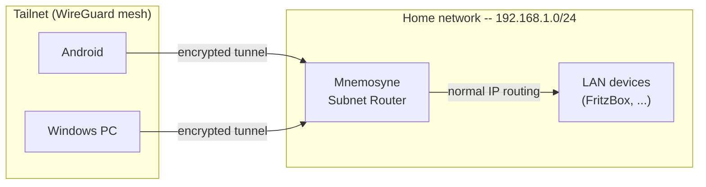

# Tailscale

Tailscale connects all devices into an encrypted WireGuard mesh network without port forwarding or firewall changes. Mnemosyne acts as a subnet router -- all home network devices become reachable from anywhere via Tailscale, without needing Tailscale installed on each device.

---

## Architecture

```
Tailnet (100.x.x.x)
├── Mnemosyne      ← Subnet Router for 192.168.1.0/24
├── Boreas
├── Zephyros
├── Windows PC
└── Android

Reachable via Subnet Router (no Tailscale required on device):
├── FritzBox       (192.168.1.1)
├── Pi-hole        (192.168.1.11)
└── All other LAN devices
```



**Why not WireGuard directly on the FritzBox?** Tailscale establishes peer-to-peer tunnels -- traffic goes directly between devices without routing through a central hub. For video streaming use cases this matters significantly. The coordination server (Tailscale's infrastructure) only handles key exchange and NAT traversal; it never sees traffic.

---

## Configuration reference

| Parameter | Value |
|---|---|
| Install method | apt (via Tailscale repository) |
| Service | systemd (`tailscaled.service`) |
| Subnet Router | `192.168.1.0/24` (advertised by Mnemosyne) |
| MagicDNS | Disabled -- Pi-hole handles DNS |
| Free tier | Up to 100 devices, 3 users |

---

## Installation

### Linux (Mnemosyne, Boreas, Zephyros)

```bash
curl -fsSL https://tailscale.com/install.sh | sh
```

This sets up an apt repository -- subsequent updates come through `apt upgrade` like any other package.

```bash
tailscale version
systemctl status tailscaled
```

### Enable IP forwarding (subnet router only)

Mnemosyne needs to forward packets for other LAN devices. This is not required on Boreas or Zephyros.

```bash
echo 'net.ipv4.ip_forward = 1' | sudo tee -a /etc/sysctl.d/99-tailscale.conf
echo 'net.ipv6.conf.all.forwarding = 1' | sudo tee -a /etc/sysctl.d/99-tailscale.conf
sudo sysctl -p /etc/sysctl.d/99-tailscale.conf

# Verify
sysctl net.ipv4.ip_forward
# Expected: net.ipv4.ip_forward = 1
```

### Authenticate and advertise routes

```bash
# Subnet router (Mnemosyne)
sudo tailscale up --advertise-routes=192.168.1.0/24

# Regular node (Boreas, Zephyros)
sudo tailscale up
```

Open the URL shown in the output, log in with your Tailscale account, approve the device.

Then approve the subnet route in the admin console:

```
https://login.tailscale.com/admin/machines
→ Mnemosyne → Edit route settings → Approve 192.168.1.0/24
```

Without approval in the admin console, `--advertise-routes` is just an announcement -- no packets are forwarded.

### Make subnet routing persistent across reboots

`tailscaled` starts automatically, but the `tailscale up` flags are not re-applied after a reboot. Fix with a systemd oneshot service:

```bash
sudo nano /etc/systemd/system/tailscale-up.service
```

```ini
[Unit]
Description=Tailscale up with subnet routing
After=tailscaled.service
Requires=tailscaled.service

[Service]
Type=oneshot
ExecStart=/usr/bin/tailscale up --advertise-routes=192.168.1.0/24
RemainAfterExit=yes

[Install]
WantedBy=multi-user.target
```

```bash
sudo systemctl enable tailscale-up.service
sudo systemctl start tailscale-up.service
```

### Windows

Download from [tailscale.com/download/windows](https://tailscale.com/download/windows), install, log in via the system tray icon.

### Android

Install from the Play Store. After connecting, disable battery optimization for the app -- Android aggressively kills background services:

```
Settings → Apps → Tailscale → Battery → Unrestricted
```

---

## DNS: Pi-hole over Tailscale

Tailscale has its own DNS feature (MagicDNS). Running both MagicDNS and Pi-hole simultaneously causes conflicts. The recommended setup:

**Disable MagicDNS** and use Pi-hole as the DNS server for the entire Tailnet:

```
Tailscale Admin → DNS → MagicDNS → Disable
Tailscale Admin → DNS → Global nameservers → add Boreas' Tailscale IP
```

This gives DNS filtering on all devices even when away from home, and `.home` domains resolve correctly everywhere in the Tailnet.

Add a fallback nameserver (`1.1.1.1` or `9.9.9.9`) so DNS still works if Boreas is unreachable.

---

## How the subnet router works

```
Without subnet router:          With subnet router:

Tailnet                         Tailnet
├── Mnemosyne  ✅               ├── Mnemosyne  ✅
├── Android    ✅               ├── Android    ✅
└── FritzBox   ❌               └── FritzBox   ✅ (via Mnemosyne)
```

Packet flow from Android to a LAN device (`192.168.1.x`):

1. Android's routing table: `192.168.1.0/24` is reachable via Mnemosyne in the Tailnet
2. Packet is encrypted and sent peer-to-peer to Mnemosyne (WireGuard)
3. Mnemosyne decrypts and forwards into the LAN (normal IP routing)
4. LAN device receives the packet -- sees Mnemosyne's LAN IP as source

---

## Security considerations

All devices in your Tailnet can reach all `192.168.1.x` devices via the subnet router -- including the FritzBox admin interface, Pi-hole, Syncthing, and any other internal service. This is intentional for personal use.

If you ever add devices belonging to other people, use Tailscale ACLs to restrict which device can reach which:

```
Tailscale Admin → Access controls → JSON configuration
```

---

## Useful commands

```bash
tailscale status                    # all connected devices with their 100.x.x.x IPs
tailscale ip                        # this device's Tailscale IP
tailscale ping 100.x.x.x            # test connectivity to a device
tailscale ping --verbose 100.x.x.x  # direct vs. DERP relay
tailscale netcheck                  # network diagnostics
journalctl -u tailscaled -f         # daemon logs
sudo tailscale down                 # disconnect (without uninstalling)
sudo tailscale up --advertise-routes=192.168.1.0/24   # reconnect
tailscale set --hostname=mnemosyne  # rename this device
```

---

## Troubleshooting

| Symptom | Cause | Fix |
|---|---|---|
| LAN device not reachable via Tailscale | Subnet route not approved | Admin console → Mnemosyne → Edit route settings → Approve |
| Subnet route missing after reboot | `tailscale up` flags not persistent | Set up the systemd oneshot service (see above) |
| High latency | No direct peer-to-peer tunnel, using DERP relay | `tailscale ping --verbose` -- check relay vs. direct |
| DNS not resolving in Tailnet | MagicDNS conflict with Pi-hole | Disable MagicDNS, add Pi-hole as global nameserver |
| `.home` domains not resolving remotely | Pi-hole not set as Tailnet DNS | Add Boreas' Tailscale IP as nameserver in admin console |
| `tailscale up` asks for re-authentication | State lost or expired | Open the URL in a browser and log in again |
| Subnet route not visible on clients | IP forwarding not active | `sysctl net.ipv4.ip_forward` -- should be `1` |
| Android disconnects in background | Battery optimization | Settings → Apps → Tailscale → Battery → Unrestricted |
