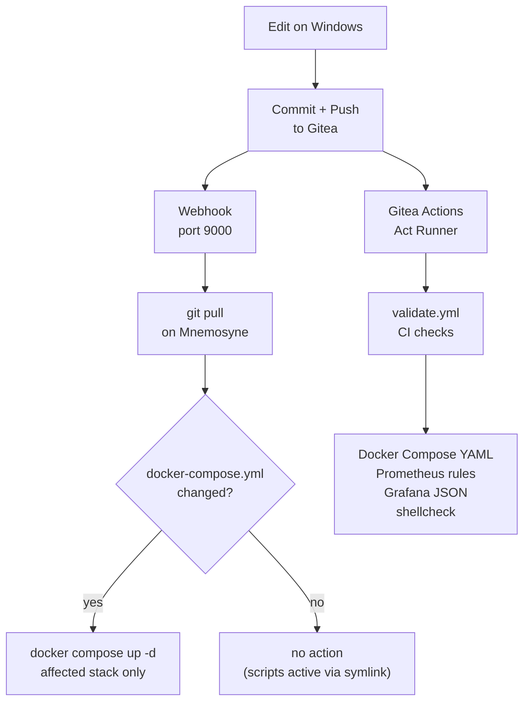

# Workflow

How changes move from a Windows workstation to running containers on Mnemosyne — and how the CI pipeline validates them along the way.

---

## Overview



The webhook handler and the CI runner operate in parallel. The webhook deploys; Actions validates and reports in the Gitea UI.

---

## Daily Workflow

### Change a stack config

```bash
# Edit on Windows:
mnemosyne/stacks/nextcloud/docker-compose.yml

# Commit and push
git add mnemosyne/stacks/nextcloud/docker-compose.yml
git commit -m "nextcloud: increase PHP memory limit to 1G"
git push
```

Mnemosyne pulls the commit automatically. The webhook detects the changed `docker-compose.yml` and runs `docker compose up -d` for that stack only. Other stacks are not touched.

### Change a script

```bash
# Edit on Windows:
mnemosyne/scripts/backup-services.sh

git add mnemosyne/scripts/backup-services.sh
git commit -m "backup: add Gitea to rotation"
git push
```

Scripts are active immediately after pull — `/usr/local/bin/backup-services.sh` is a symlink to the repo file. No stack restart needed.

### Add a new environment variable

```bash
# 1. Edit .env on Mnemosyne first (never commit this file)
nano ~/stacks/<stack>/.env

# 2. Update .env.example on Windows
mnemosyne/stacks/<stack>/.env.example

# 3. Reference the new variable in docker-compose.yml
git add mnemosyne/stacks/<stack>/.env.example
git add mnemosyne/stacks/<stack>/docker-compose.yml
git commit -m "<stack>: add XY environment variable"
git push
```

Always set the `.env` value on Mnemosyne **before** pushing. The webhook will restart the stack immediately after pull — if the variable is missing, the container starts without it.

### Add a new stack

```bash
# 1. Create and test locally on Mnemosyne
mkdir -p ~/stacks/<new-stack>
nano ~/stacks/<new-stack>/docker-compose.yml
nano ~/stacks/<new-stack>/.env
docker compose up -d
docker compose logs -f

# 2. Add to the repo
cd ~/homelab-infra
git add mnemosyne/stacks/<new-stack>/
git status    # .env must NOT appear here
git commit -m "feat: add <new-stack>"
git push
```

### Export Grafana dashboards

After making changes in the Grafana UI:

```bash
~/homelab-infra/mnemosyne/scripts/export-grafana-dashboards.sh

git add mnemosyne/stacks/monitoring/grafana/dashboards/
git commit -m "grafana: export updated dashboards"
git push
```

Grafana dashboard changes do not trigger a monitoring stack restart — intentional.

---

## What the Webhook Does Not Automate

| Action | Must be done manually |
|---|---|
| Create `.env` on Mnemosyne | `nano ~/stacks/<stack>/.env` |
| Start a new stack for the first time | `docker compose up -d` in stack directory |
| Import Caddy root certificate on a new device | Once per device |
| Apply changes to Boreas or Zephyros | SSH to host + manual change |
| Commands requiring `sudo` (systemd, iptables) | Directly on the Pi |

---

## Commit Conventions

| Prefix | When |
|---|---|
| `feat:` | New service or functionality |
| `fix:` | Bug fix |
| `chore:` | Routine updates, dependency bumps |
| `docs:` | Documentation only |
| `refactor:` | Restructuring without functional change |

```
feat: add Immich stack
fix: correct Nextcloud trusted_domains
chore: sync stack configs after monitoring update
docs: add Grafana export to RUNBOOK
refactor: consolidate monitoring .env
```

---

## CI Pipeline: Gitea Act Runner

Validation runs on every push via a Gitea Act Runner on Mnemosyne. The runner is a Docker container with access to the host Docker socket and the internal Caddy CA certificate.

### Checks

| Check | Tool |
|---|---|
| Docker Compose files | `python3` + `yaml.safe_load` |
| Prometheus alert rules | `python3` + schema assertions |
| Grafana dashboard JSON | `jq empty` |
| Shell scripts | `shellcheck` |

### Runner stack

```
~/stacks/gitea-runner/
├── docker-compose.yml
├── .env               ← GITEA_RUNNER_REGISTRATION_TOKEN, GITEA_CLONE_TOKEN
└── .env.example

/mnt/codex/gitea/runner/
├── .runner            ← auth state after registration (auto-generated)
└── ca.crt             ← Caddy root CA (needed to clone from git.home over HTTPS)
```

### Re-register the runner

If the runner reports `unregistered runner` and enters a restart loop:

```bash
cd ~/stacks/gitea-runner
docker compose down

# Clear stale auth state
sudo rm -f /mnt/codex/gitea/runner/.runner

# Generate a new token: Gitea → Site Administration → Runners → Create Runner
nano ~/stacks/gitea-runner/.env   # paste new token

docker compose up -d
docker logs gitea-act-runner -f
# Expected: "Runner registered successfully."
```

The registration token is single-use. After the first start the runner stores its auth state in `.runner`. If that file is deleted, a new token must be generated.

---

## Known Limitations

**`actions/checkout@v4` not usable on Gitea**
Requires Node.js, which is not in the Alpine runner image. The workflow uses a manual `git clone` with `GIT_SSL_CAINFO` and a clone token instead.

**No repository secrets on Gitea Free**
The secrets UI (`/settings/secrets`) returns 404 on Gitea Free. The clone token is passed as an environment variable via the runner's `.env` file and `env_file` in `docker-compose.yml`.

**Alpine runner — no `apt-get`**
The `gitea/act_runner` image is Alpine-based. Use `apk` to install packages. The first `apk` call requires `--no-check-certificate` because the CA bundle is not yet present.

**Host Docker binary not mountable**
`/usr/bin/docker` from the host is a glibc binary — incompatible with Alpine (musl). Docker commands in workflow steps must go through the mounted socket or use Alpine's own Docker packages.

---

## Webhook Troubleshooting

```bash
# Last handler run
tail -30 /var/log/webhook-handler.log

# Live webhook service log
journalctl -u webhook -f

# Manual trigger (no signature check)
curl -s http://localhost:9000/hooks/gitea-pull
```

## Runner Troubleshooting

| Symptom | Cause | Fix |
|---|---|---|
| `unregistered runner` restart loop | `.runner` missing or corrupt | Delete `.runner`, generate new token |
| `SSL certificate not trusted` on `git clone` | CA not mounted or wrong permissions | `chmod 644 /mnt/codex/gitea/runner/ca.crt` |
| `ca.crt` is a directory instead of a file | `cp` copied into an empty directory | `rm -rf ca.crt` then `cp ... ca.crt` |
| `Failed to authenticate` on `git clone` | Token expired or wrong | Generate new token in Gitea |
| `apk: TLS not trusted` | Alpine has no CA bundle yet | `apk add --no-check-certificate ca-certificates && update-ca-certificates` |
