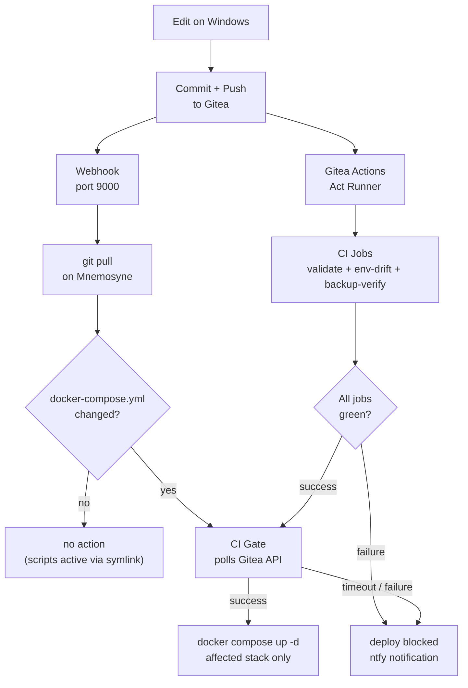

# Workflow

How changes move from a Windows workstation to running containers on Mnemosyne -- and how the CI pipeline validates and gates them along the way.

---

## Overview



The webhook handler and the CI runner operate in parallel on every push. The handler waits for all CI jobs to pass before deploying -- if CI fails or times out, the deploy is blocked and a push notification is sent.

---

## CI Gate

The webhook handler checks the Gitea commit status API before deploying any stack. It retries up to 5 times with 15-second intervals (75 seconds total), then blocks the deploy if CI has not completed.

```
time="..." level=info event=stacks_pending commit=b179f51 stacks=monitoring
time="..." level=info event=ci_gate_check commit=b179f51 attempt=1 max=5 status=pending
time="..." level=info event=ci_gate_check commit=b179f51 attempt=2 max=5 status=pending
time="..." level=info event=ci_gate_check commit=b179f51 attempt=3 max=5 status=success
time="..." level=info event=ci_gate_passed commit=b179f51
time="..." level=info event=stack_restart stack=monitoring method=up_d
time="..." level=info event=deploy_finished commit=b179f51 stacks=monitoring duration_s=31
```

| CI result | Deploy outcome |
|---|---|
| All jobs `success` | Deploy proceeds |
| Any job `failure` or `error` | Deploy blocked immediately |
| Still `pending` after 75s | Deploy blocked (runner down or stuck) |
| No stack changed | CI gate skipped entirely |

---

## CI Pipeline: Gitea Act Runner

Two workflows run on every push to `main`:

| Workflow | What it checks |
|---|---|
| `validate.yml` | Docker Compose YAML, Prometheus alert rules, Grafana dashboard JSON, shell scripts |
| `env-drift.yml` | `.env.example` keys vs. `docker-compose.yml` references per stack |

### env-drift check

The drift checker compares each stack's `.env.example` against the variables referenced in `docker-compose.yml`:

- **dead keys** -- documented in `.env.example` but not referenced in compose (skipped for stacks using `env_file:`)
- **missing keys** -- referenced in compose but not documented in `.env.example`

Stacks that use `env_file: .env` pass the entire file directly to the container at runtime. Variables don't appear as `${VAR}` references in compose, so the dead-key check is intentionally skipped for those stacks.

### Runner stack

```
~/stacks/gitea-runner/
├── docker-compose.yml
├── .env               ← GITEA_RUNNER_REGISTRATION_TOKEN, GITEA_CLONE_TOKEN
└── .env.example

/mnt/codex/gitea/runner/
├── .runner            ← auth state after registration (auto-generated)
├── id_ed25519         ← SSH key for backup-verify workflow
└── ca.crt             ← Caddy root CA (needed to clone from git.home over HTTPS)
```

### Re-register the runner

```bash
cd ~/stacks/gitea-runner
docker compose down
sudo rm -f /mnt/codex/gitea/runner/.runner
# Generate a new token: Gitea → Site Administration → Runners → Create Runner
nano ~/stacks/gitea-runner/.env
docker compose up -d
docker logs gitea-act-runner -f
# Expected: "Runner registered successfully."
```

The registration token is single-use. After the first start the runner stores its auth state in `.runner`. If that file is deleted, a new token must be generated.

---

## Structured Logging

The webhook handler writes logfmt to `/var/log/webhook-handler.log`. Every line has `time=`, `level=`, and `event=` fields.

```
time="2026-06-11T20:56:19+0200" level=info event=webhook_triggered
time="2026-06-11T20:56:19+0200" level=info event=git_pull_ok commit=b179f51
time="2026-06-11T20:56:19+0200" level=info event=stacks_pending commit=b179f51 stacks=monitoring
time="2026-06-11T20:56:19+0200" level=info event=ci_gate_passed commit=b179f51
time="2026-06-11T20:56:19+0200" level=info event=stack_restarted stack=monitoring
time="2026-06-11T20:56:20+0200" level=info event=deploy_finished commit=b179f51 stacks=monitoring duration_s=31
```

Useful grep patterns:

```bash
grep event=deploy_finished /var/log/webhook-handler.log
grep level=warn /var/log/webhook-handler.log
grep "stacks=monitoring" /var/log/webhook-handler.log
```

---

## Daily Workflow

### Change a stack config

```bash
# Edit on Windows:
mnemosyne/stacks/nextcloud/docker-compose.yml

git add mnemosyne/stacks/nextcloud/docker-compose.yml
git commit -m "nextcloud: increase PHP memory limit to 1G"
git push
```

Mnemosyne pulls the commit automatically. The webhook detects the changed `docker-compose.yml`, waits for CI to pass, then runs `docker compose up -d` for that stack only.

### Change a script

```bash
git add mnemosyne/scripts/backup-services.sh
git commit -m "backup: add Gitea to rotation"
git push
```

Scripts are active immediately after pull -- `/usr/local/bin/backup-services.sh` is a symlink to the repo file. No stack restart needed, no CI gate involved.

### Add a new environment variable

```bash
# 1. Edit .env on Mnemosyne first (never commit this file)
nano ~/stacks/<stack>/.env

# 2. Update .env.example and docker-compose.yml on Windows
# 3. Commit and push
git add mnemosyne/stacks/<stack>/.env.example
git add mnemosyne/stacks/<stack>/docker-compose.yml
git commit -m "<stack>: add XY environment variable"
git push
```

Always set the `.env` value on Mnemosyne **before** pushing. The webhook restarts the stack immediately after CI passes -- if the variable is missing at that point, the container starts without it.

### Add a new stack

```bash
# 1. Create and test locally on Mnemosyne
mkdir -p ~/stacks/<new-stack>
nano ~/stacks/<new-stack>/docker-compose.yml
nano ~/stacks/<new-stack>/.env
docker compose up -d && docker compose logs -f

# 2. Add to the repo
git add mnemosyne/stacks/<new-stack>/
git status    # .env must NOT appear here
git commit -m "feat: add <new-stack>"
git push
```

---

## What the Webhook Does Not Automate

| Action | Must be done manually |
|---|---|
| Create `.env` on Mnemosyne | `nano ~/stacks/<stack>/.env` |
| Start a new stack for the first time | `docker compose up -d` in stack directory |
| Import Caddy root certificate on a new device | Once per device |
| Apply changes to Boreas or Zephyros | SSH to host + manual change |
| Commands requiring `sudo` (systemd, iptables) | Directly on the host |

---

## Commit Conventions

| Prefix | When |
|---|---|
| `feat:` | New service or functionality |
| `fix:` | Bug fix |
| `chore:` | Routine updates, dependency bumps |
| `docs:` | Documentation only |
| `refactor:` | Restructuring without functional change |

---

## Known Limitations

**`actions/checkout@v4` not usable on Gitea**
Requires Node.js, which is not in the Alpine runner image. Workflows use a manual `git clone` with `GIT_SSL_CAINFO` and a clone token instead.

**No repository secrets on Gitea Free**
The secrets UI returns 404 on Gitea Free. Tokens are passed as environment variables via the runner's `.env` file and `env_file` in `docker-compose.yml`.

**Alpine runner -- no `apt-get`**
The `gitea/act_runner` image is Alpine-based. Use `apk` to install packages. The first `apk` call requires `--no-check-certificate` because the CA bundle is not yet present.

---

## Troubleshooting

```bash
# Last handler run
tail -30 /var/log/webhook-handler.log

# Live webhook service log
journalctl -u webhook -f

# Check CI gate status for a commit manually
curl -sL -H "Authorization: token <token>" \
  "http://localhost:3000/api/v1/repos/<owner>/<repo>/commits/<sha>/statuses"
```

| Symptom | Cause | Fix |
|---|---|---|
| `ci_gate_timeout` in log | Runner down or jobs stuck | Check runner: `docker logs gitea-act-runner` |
| `ci_gate_skipped reason=no_token` | Secrets file not readable by service user | `chown root:<user> /etc/webhook-secrets.conf && chmod 640` |
| `unregistered runner` restart loop | `.runner` missing or corrupt | Delete `.runner`, generate new token |
| `SSL certificate not trusted` on `git clone` | CA not mounted or wrong permissions | `chmod 644 /mnt/codex/gitea/runner/ca.crt` |
| `apk: TLS not trusted` | Alpine has no CA bundle yet | `apk add --no-check-certificate ca-certificates && update-ca-certificates` |
| env-drift false positives | `env_file:` stack -- vars not referenced in compose | Expected -- dead-key check skipped for `env_file` stacks |
